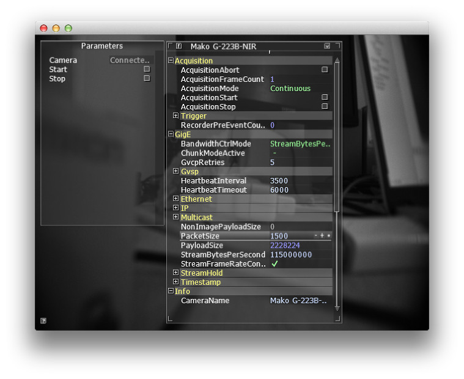

Cinder-PvApi
============

Cinder block for Allied Vision Technology's PvAPI SDK for GigE Vision cameras.

Requires Cinder v0.9.

Mono and Rgb24 pixel formats are supported.

TODO

  * Rgb24 format is not tested because of a lack of camera

